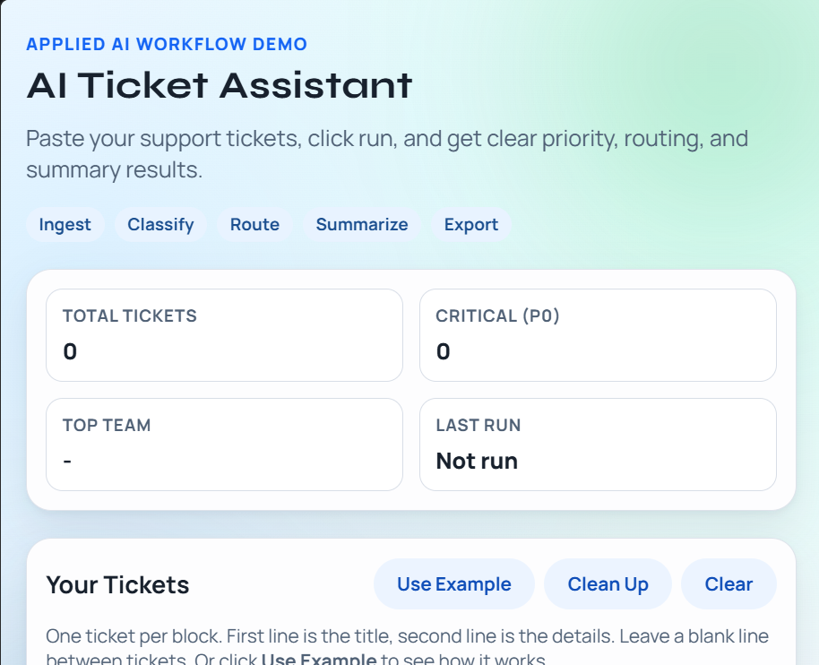

# AI Ticket Assistant — FastAPI | Python | Docker | CI/CD

[](https://fastapi.tiangolo.com/)
[](https://www.python.org/)
[](https://www.uvicorn.org/)
[](https://docs.pydantic.dev/)
[](https://platform.openai.com/)
[](https://pytest.org/)
[](https://www.docker.com/)
[](https://render.com/)
[](https://github.com/yousafzeb-byte/AI-Ticket-Triage-Workflow-Automation/actions/workflows/ci.yml)

## Recruiter Snapshot

- Built a full-stack AI triage app with a FastAPI backend, vanilla JS frontend, and automated keyword-based classification engine.
- Designed a plain-English UI — no JSON, no technical input required from the end user.
- Implemented priority scoring (P0–P3) and team routing across 5 domains: Security, Billing, Auth, Platform, and Support.
- Wired in optional OpenAI summarisation with a reliable rule-based fallback so the app works with or without an API key.
- Added CI with GitHub Actions (8 consecutive passing runs), Docker containerisation, and Render deployment config.

## Architecture At A Glance

- FastAPI app serves both the REST API and the static frontend from a single process.
- Keyword-matching engine in `workflow.py` drives priority and team inference — deterministic and testable.
- `OptionalLLMSummarizer` wraps OpenAI with graceful fallback so the app never breaks without a key.
- Pydantic models enforce request validation at the API boundary.
- Frontend communicates via `POST /api/triage` and requires no build step — plain HTML, CSS, JS.

## Visual Showcase



## 🎯 What It Does

Paste support tickets in plain English, click **Run**, and get back:

- **Priority level** — P0 (critical) to P3 (low)
- **Assigned team** — Security, Billing, Auth, Platform, or Support
- **Reason** — why that priority and team were chosen
- **Summary** — one-line plain English description of the issue

## 📋 Features

### 🧠 AI Triage Engine

- Keyword-based priority and routing — no model required
- Optional OpenAI integration for richer summaries (`gpt-4.1-mini`)
- Rule-based fallback summary when AI is unavailable
- Handles multiple tickets in a single run

### 🖥️ Frontend Dashboard

- Plain-English input — type tickets naturally, no JSON or brackets
- Stats bar: total tickets, critical count, top team, last run time
- Copy and download results buttons
- Detailed view panel for full JSON output
- Mobile-friendly responsive layout

### 🔌 REST API

- `POST /api/triage` — classify and route a batch of tickets
- `GET /api/tickets/sample` — load example tickets
- `GET /api/health` — health check endpoint
- Auto-generated interactive docs at `/docs`

### 🚀 DevOps & Quality

- GitHub Actions CI — runs on every push to `main`
- Dockerfile for containerised deployment
- Docker Compose for local multi-service setup
- `render.yaml` for one-click Render deployment
- 4 automated tests covering triage logic and API endpoints

## 🚀 Quick Start

### 1. Install Dependencies

```bash
pip install -r requirements.txt
```

### 2. (Optional) Enable AI Summaries

```bash
copy .env.example .env
# Add your OPENAI_API_KEY to .env
```

### 3. Run the App

```bash
uvicorn src.api:app --reload
```

Open `http://127.0.0.1:8000` in your browser.

## 🔌 API Endpoints

| Method | Endpoint              | Description                           |
| ------ | --------------------- | ------------------------------------- |
| `POST` | `/api/triage`         | Classify and route a batch of tickets |
| `GET`  | `/api/tickets/sample` | Returns sample tickets                |
| `GET`  | `/api/health`         | Health check                          |
| `GET`  | `/docs`               | Interactive Swagger UI                |

## 🛠️ Technologies Used

- **FastAPI 0.115** — REST API framework
- **Uvicorn** — ASGI server
- **Pydantic** — Request validation and serialisation
- **OpenAI SDK** — Optional AI summarisation (`gpt-4.1-mini`)
- **Python-dotenv** — Environment variable management
- **pytest + httpx** — API and unit testing
- **Docker + Docker Compose** — Containerisation
- **Render** — Cloud deployment target
- **GitHub Actions** — CI pipeline

## 📁 Project Structure

```
AI-Ticket-Triage_Assistant/
├── .github/
│   └── workflows/
│       └── ci.yml                # GitHub Actions CI pipeline
├── data/
│   └── tickets.json              # Sample ticket data
├── src/
│   ├── api.py                    # FastAPI app, routes, request models
│   ├── models.py                 # Ticket and TriageResult data models
│   ├── workflow.py               # Priority + team inference engine
│   └── main.py                   # CLI entry point
├── tests/
│   ├── conftest.py               # Pytest path setup
│   └── test_api.py               # API and triage logic tests
├── web/
│   ├── index.html                # Frontend dashboard
│   ├── styles.css                # Responsive stylesheet
│   └── app.js                    # Frontend logic
├── Dockerfile                    # Container build definition
├── docker-compose.yml            # Local multi-service config
├── render.yaml                   # Render deployment config
├── requirements.txt              # Python dependencies
└── .env.example                  # Environment variable template
```

## ✅ Project Checklist

### Triage Engine

- ✅ Keyword-based priority scoring (P0–P3)
- ✅ Team routing across 5 domains
- ✅ Rule-based summary fallback
- ✅ Optional OpenAI integration

### Frontend

- ✅ Plain-English ticket input (no JSON)
- ✅ Stats dashboard (total, critical, top team, last run)
- ✅ Copy and download results
- ✅ Responsive mobile layout

### API

- ✅ Batch triage endpoint with Pydantic validation
- ✅ Sample data endpoint
- ✅ Health check endpoint
- ✅ Auto-generated Swagger docs

### DevOps & CI/CD

- ✅ GitHub Actions CI — passing on all pushes
- ✅ Dockerfile for containerised builds
- ✅ Docker Compose for local development
- ✅ Render deployment config (`render.yaml`)
- ✅ 4 automated tests

## 🚀 Deployment

### Docker

```bash
docker build -t ai-ticket-assistant .
docker run -p 8000:8000 --env-file .env ai-ticket-assistant
```

### Docker Compose

```bash
docker-compose up --build
```

### Render

Connect this repo to [Render](https://render.com). It will detect `render.yaml` automatically and deploy using Docker. Set `OPENAI_API_KEY` in Render's environment variables (optional).

## 🔒 Security Notes

- API keys are never committed — use `.env` locally and Render environment variables in production.
- Input is validated with Pydantic at the API boundary before processing.
- CORS is configured to allow frontend–backend communication.

## 👨‍💻 Author

**Yousaf Zeb**
Full-Stack Software Engineer | Python · FastAPI · React · CI/CD
